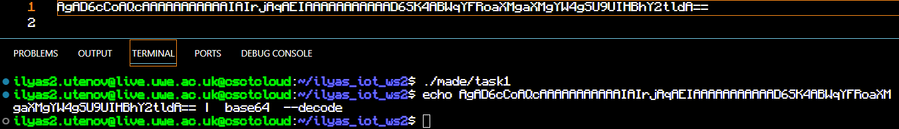
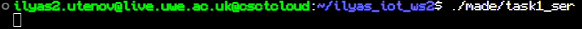
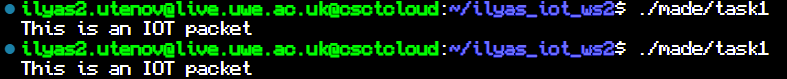
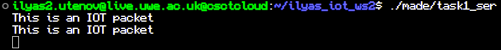
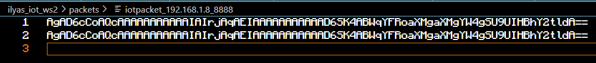
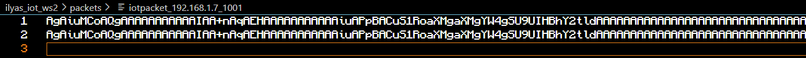

# ilyas_iot_ws2

## Part 1

For some reason I was not able to access port 8877 due to mutex,
changing server port to 8888 helped me solve the issue.

Changes in .cpp file:

    const  int server_port =  8888;

Changes in packet files scripts:

    /opt/iot/bin/create_packetfile 192.168.1.8 8888

Resieve and echo on server loop:

    while(sock.recvfrom(buffer, 1024,0, (struct sockaddr *)&client_address,&client_address_size)){

    std::cout<<buffer<<std::endl;

    sock.sendto(buffer, 1024,0, &client_address, client_address_size);
    }

Resieve echo on client:

    sock.recvfrom(buffer, 1024,0, (sockaddr *)&server_address,&server_address_size);

    std::cout<<buffer<<std::endl;

Server launch:

Sending message twice:

Server after recieveing message:

Packet files after message:

