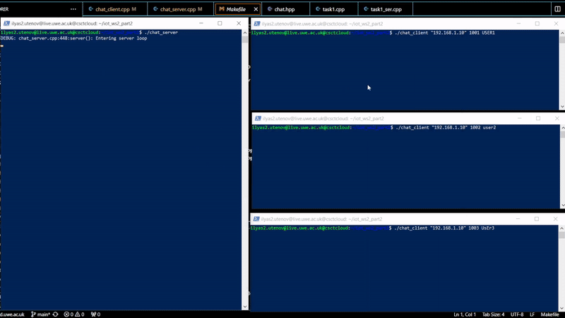

# IOT Worksheet2 part2 by Ilyas Utenov

## Task 1

handle exit function:

    //set up exit message
    auto msg = chat::exit_msg();
    for(auto user : online_users){
    // send exit message (chat::exit_msg()) to each user
        int len = sock.sendto(
            reinterpret_cast<const char*>(&msg), sizeof(chat::chat_message), 0,
            (sockaddr*)user.second, sizeof(client_address));
    }
    //clear up memory
    online_users.clear();

handle dm function:

    // check if user matches the incoming client address, if so send message
    // is done to correctly display transmitter and reciever
    if(std::strcmp(inet_ntoa(user.second->sin_addr),inet_ntoa(client_address.sin_addr))==0&&
        client_address.sin_port == user.second->sin_port){
            auto msg = chat::dm_msg(user.first,message);
            int len = sock.sendto(
                reinterpret_cast<const char*>(&msg), sizeof(chat::chat_message), 0,
                (sockaddr*)search->second, sizeof(client_address));
                break;
    }

handle join function:

    online_users[username] = new sockaddr_in(client_address);
    // add new user to known user map
    auto msg = chat::jack_msg();
    // set up a jack message
    int len = sock.sendto(reinterpret_cast<const char*>(&msg), sizeof(chat::chat_message), 0,
    (sockaddr*)&client_address, sizeof(struct sockaddr_in));
    // send back JACK message to client that has joined
    handle_broadcast(online_users, username, "has joined the server", client_address, sock, exit_loop);
    // send broadcast (use handle broadcast) to all other clients
    handle_list(online_users, "__ALL", "", client_address, sock, exit_loop);
    // send list message (use handle_list) set 2nd argument to "__ALL"

## Task 2

make reciever function:

    // receive message from server, send it over channel (tx) to main UI thread
    int len = sock->recvfrom(reinterpret_cast<char*>(&msg), sizeof(chat::chat_message), 0,nullptr,nullptr);
    tx.send(msg);

main function:

    switch(type) {
        case chat::EXIT: {
            DEBUG("Received Exit from GUI\n");
            //set up am exit message
            auto msg =chat::exit_msg();
            //send it
            int len = sock.sendto(reinterpret_cast<const char*>(&msg),sizeof(chat::chat_message),
            0, (sockaddr*)&server_address, sizeof(server_address));
            //terminate
            sent_leave = true;
            exit_loop=true;
            // you need to fill in
            break;
        }
        case chat::LEAVE: {
            DEBUG("Received LEAVE from GUI\n");
            //set up leave message
            auto msg = chat::leave_msg();
            //send it so the server knows
            int len = sock.sendto(reinterpret_cast<const char*>(&msg), sizeof(chat::chat_message), 0,
                (sockaddr*)&server_address, sizeof(server_address));
            //terminate
            sent_leave=true;
            // you need to fill in
            break;
        }
        case chat::LIST: {
            //set up a list message
            auto msg = chat::list_msg();
            //send it
            int len = sock.sendto(reinterpret_cast<const char*>(&msg), sizeof(chat::chat_message), 0,
                (sockaddr*)&server_address, sizeof(server_address));
            // you need to fill in
            break;
        }
        default: {
            // the default case is that the command is a username for DM
            // <username> : message
            if (cmds.size() == 2) {
                //set up a dm
                auto msg = chat::dm_msg(cmds[0],cmds[1]);
                //send it
                int len = sock.sendto(reinterpret_cast<const char*>(&msg), sizeof(chat::chat_message), 0,
                    (sockaddr*)&server_address, sizeof(server_address));
            }
            break;
        }
    }

Users join:

Broadcast, DM an leave:

Exit:

## Task 3

Work in progress...

Tried many things, from interpritating a group chat as user to as another servers
Could not come up with solution