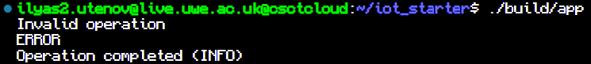
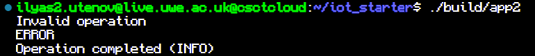
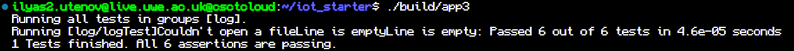

# IoT Woksheet1 by Ilyas Utenov

## Task1

line function:

    std::string line(std::string message){
	    std::string line;
    	bool flag=false;
        for(int i=0;i<sizeof(message);i++){
            if(message[i]==':'){flag=true;i+=2;}
            if(flag){line=line+message[i];}
        }

        return line;
    }

error function:

    std::string error(std::string message){
        std::string error;
        bool flag=false;
        for(int i=0;i<sizeof(message);i++){
            if(message[i]=='['){flag=true;i++;}
            if(message[i]==']'){flag=false;}
            if(flag){error=error+message[i];}
        }
        return error;
    }

reformat function:

    std::string reformat(std::string message){
        std::string er,li;
        bool eflag=false;
        bool mflag=false;
        for(int i=0;i<sizeof(message);i++){
            if(message[i]==']'){eflag=false;}
            if(eflag){er=er+message[i];}
            if(mflag){li=li+message[i];}
            if(message[i]=='['){eflag=true;}
            if(message[i]==' '){mflag=true;}
        }
        li=li+" ("+er+')';
        return li;
    }

## Task2

log.hpp

    #pragma once
    #include <string>
    #include <fstream>

    class log{
        private:
        public:
            log();
            ~log();

            bool create_log(std::string filename);
            bool next();
            std::ifstream LogFile;
            std::string message;
            std::string line();
            std::string error();
            std::string reformat();
    };

log.cpp

    #include <iostream>
    #include <fstream>
    #include "log.hpp"
    #include <string>

    log::log(){

    }

    log::~log(){
        LogFile.close();
    }

    bool log::create_log(std::string filename){
        LogFile.open(filename);
        if(!LogFile.is_open()){std::cout<<"Couldn't open a file";return false;}
        return true;
    }

    bool log::next(){
        getline(LogFile,message);
        if(!message.empty()){return true;}
        else{std::cout<<"Line is empty";return false;}
    }

'+' functions from task1

Changes in Makefile

    CPP_SOURCES = src/log.cpp
    CPP_HEADERS = src/log.hpp

## Task3

main.cpp

    #include "log.hpp"
    #include "../simpletest/simpletest.h"
    #include <string>

    using namespace std;

    char const * groups[]={
        "log",
    };

    DEFINE_TEST_G(logTest,log){
        log Log;
        bool success = Log.create_log("../log.in");
        TEST_MESSAGE(success != true,"Failed to open log file");

        success=Log.next();
        TEST_MESSAGE(success != true,"Failed to read log file");

        std::string line =Log.line();
        TEST_MESSAGE(line.compare("Invalid operation")!= 0, "Expeсting: Invalid operation");

        line = Log.error();
        TEST_MESSAGE(line.compare("ERROR")!= 0, "Expecting: ERROR");

        success=Log.next();
        line = Log.reformat();
        TEST_MESSAGE(success != true,"Failed to read log file");

        TEST_MESSAGE(line.compare("Operation completed (INFO)")!= 0, "Expecting: Operation completed (INFO)");
    }

    int main(){
        bool pass =true;

        for(auto group : groups){
            pass &= TestFixture::ExecuteTestGroup(group,TestFixture::Verbose);
        }

        return pass ? 0 : 1;
    }

Changes in Makefile

    CPP_SOURCES = src/log.cpp simpletest/simpletest.cpp
    CPP_HEADERS = src/log.hpp simpletest/simpletest.hpp

