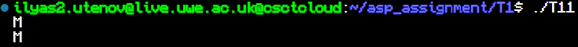
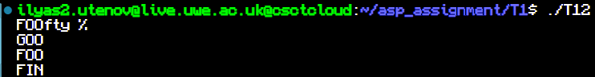
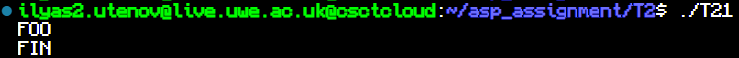
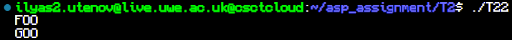
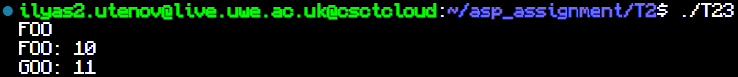
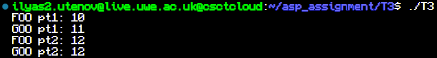

# asp_assignment


## Task1

First task as a whole is provided in form of pseudo code, so
the only thing worth mentioning is how I tried to use context to break a process into parts
in order to complete another process in between.

```cpp
void foo(){
    volatile int x = 1;
    std::cout<<"FOOfty %"<<std::endl;
    get_context(&c);
    if(x){
        x=0;
        set_context(&b);
    }
    std::cout<<"FOO"<<std::endl;
    set_context(&a);
}
```

building lines:

```
clang++ -o T11 T11.cpp ../context/context.o
```
```
clang++ -o T12 T12.cpp ../context/context.o
```

## Task2

The task provides pseudo code for each part so there isn't much to brag about.

I have used default arguments to implement optional data pointer for the last part

```cpp
scheduler(int* pointer = nullptr){
    this->dp = pointer;
};
```

building lines:

```
clang++ -o T21 T21.cpp ../context/context.o
```
```
clang++ -o T22 T22.cpp ../context/context.o
```
```
clang++ -o T23 T23.cpp ../context/context.o
```

## Task3

yeild() function is rather simple. All it does, is places the fiber back in the queue and 
hands the control back to the do_it() function.
Honestly, don't unerstand why set_context() wouldn't work, but after experimenting with it and
finding out swap_context() exists, managed to make it work.

```cpp
void scheduler::yeild(){
    fibers.push_back(this->current_fiber);
    swap_context(&this->current_fiber->get_context(),&c);
}
```

building line:

```
clang++ -o T3 T3.cpp Fibers.cpp ../context/context.o
```

## Screenshots

Task 1-1



Task 1-2



Task 2-1



Task 2-2



Task 2-3



Task 3


