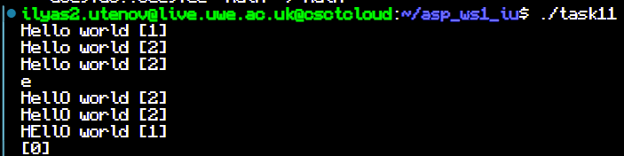
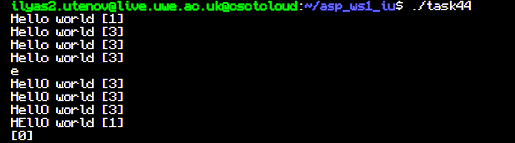

# ASP_WS1_IU


## Tasks 1-3

String and reference count are stored as pointers to be shared between objects

```cpp
private:
    char* stringi;
    int* ref;

public:
    ssstr();
    ssstr(const char* s) {
        ref = new int; // initializing counter T2
        *ref = 1;
        stringi = new char[strlen(s)+1]; // dynamic malloc T1
        strcpy(stringi,s);

    };
    ssstr(ssstr const& s){
            this->ref = s.ref; //copying address and incrementing value T2
            *ref += 1;            
            stringi = s.stringi; //copying string address T1
            
    };

    ...

    ~ssstr(){
        *ref -= 1; //decrement once gone T2
        if(*ref==0){
            cout<<"[0]"<<endl; //T3
        }
        };
```

## Task 4

Template class is used in reference counter class to allow it to be used with any other class

```cpp
template <class C>

class ref_counter{
    private:
        int* ref;

    public:
        C* cont_class;
        ref_counter();
        ref_counter(C& s){
            cont_class = &s;
            ref = new int;
            *ref=1;
        };
        ref_counter(ref_counter& s){
            cont_class = s.cont_class;
            this->ref = s.ref;
            *ref = *s.ref+1;
        };
```


## Screenshots

Tasks 1-3



Task 4

