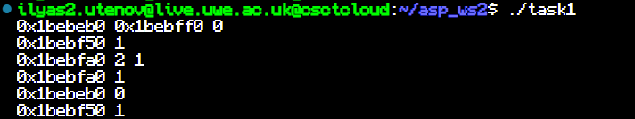
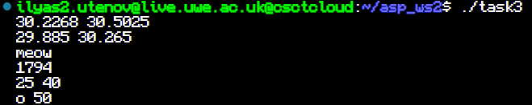

# asp_ws2

## Task 1

When allocator is constructed it sets boundaries of a memory block with size defined by user

``` cpp
...
allocator(){
    start = new int[U]; //allocating memory block
    next = start;
    heapend = start + U; // defining boundaries
    allocount=0;
};
...
```

To allocate a memory alloc() function must be supplied with datatype and quantity, example:
```cpp
al.alloc<int>(1)
```

It then checks if there is enough space left in the memory block,
in which case it returns a pointer, nullpointer is returned otherwise

```cpp
T* alloc(int n){
    if(this->next+n*sizeof(T)<=this->heapend){ //check if enough memory is available
        T* tmp = (T*)this->next;
        this->next+=n*sizeof(T); //moving pointer by the size of allocated block
        this->allocount++;
        return tmp;
        }
    else{
        return nullptr;
    }
};
```

Deallocation only decrements counter of allocations completed by 1 and if it reaches zero,
allocator is reset, meaning it will be allocating memory from the beginig of the block again

```cpp
void dealloc(K* s){
    allocount-=1;
    if(allocount==0){
        this->next = this->start; //reseting memory block
    }
}
```



## Task 2

For this task I expanded test case to check if allocator:
deallocates, resets, works with different datatypes and
if it sets own boundaries corectly


## Task 3

To implement benchmarking function I used template classes to 
supply the tested function and its argument as arguments for the benchmark function
It then executes function and calculates time it took to run the function, while also saving the result
Variadic template is used to support varying argument number and types

```cpp

template <typename K, typename... Args>
auto benchmark(K func, Args... args) { 
    auto t1 = std::chrono::high_resolution_clock::now();
    auto result = func(args...); //function is executed
    auto t2 = std::chrono::high_resolution_clock::now();
    auto time = std::chrono::duration_cast<std::chrono::nanoseconds>(t2 - t1); //time taken for function to run
    return std::make_pair(result,time); //result of function and time taken passed as pair
}
```

To support void type functions I copied the function, this time predefining function to be type void
In this case it is still called, but the result is not saved, "void" is passed instead

```cpp
template <typename... Args>
auto benchmark(void func(Args...), Args... args) { //support for functions of type void f(void)
    auto t1 = std::chrono::high_resolution_clock::now();
    func(args...); //function is executed
    auto t2 = std::chrono::high_resolution_clock::now();
    auto time = std::chrono::duration_cast<std::chrono::nanoseconds>(t2 - t1); //time taken for function to run
    return std::make_pair("void",time);
}
```

To implement bump down allocator all I did, is changed few lines so that allocation starts at the end of
memory block and goes down from there

```cpp
allocatordown(){
    start = new int[U];
    heapend = start + U;
    next = heapend;
    allocount=0;
    };
...
template<typename T>
T* alloc(int n){
    if(this->next-n*sizeof(T)>=this->start){ //check if enough memory is available
        this->next-=n*sizeof(T); //moving pointer down by the size of allocated block
        this->allocount++;
        return (T*)this->next;;
```

To compare how fast each kind of allocators works I found average time it took them complete lots of small allocations and fewer allocations of bigger size

```cpp
...
for (int i =0; i<200;i++){ //allocators tested for many small allocations
        elapsedd +=  benchmark(aldalloc, 1).second.count(); 
        elapsed_time +=  benchmark(alalloc, 1).second.count();
        //result of allocation is dismissed and only time is taken into account
}
}
std::cout<<elapsed_time/20000<<" "<<elapsedd/20000<<" "<<std::endl;//avg time taken for 1 allocation
...
```
```cpp
for (int i =0; i<20;i++){ //allocators tested for fewer bigger allocations
    elapsed_time += benchmark(alalloc, 10).second.count();
    elapsedd += benchmark(aldalloc, 10).second.count();
}
}
std::cout<<elapsed_time/2000<<" "<<elapsedd/2000<<std::endl;//avg time taken for 1 allocation
}
...
```



As seen on first 2 line from screenshot, average time it takes for each allocator to 
complete allocation is almost the same with difference less than 1 percent.
After running program multiple times, I have made an observation, that in 
most cases bump up allocator is the one which is a bit faster.

I have also included proves of benchmark function working with various function types