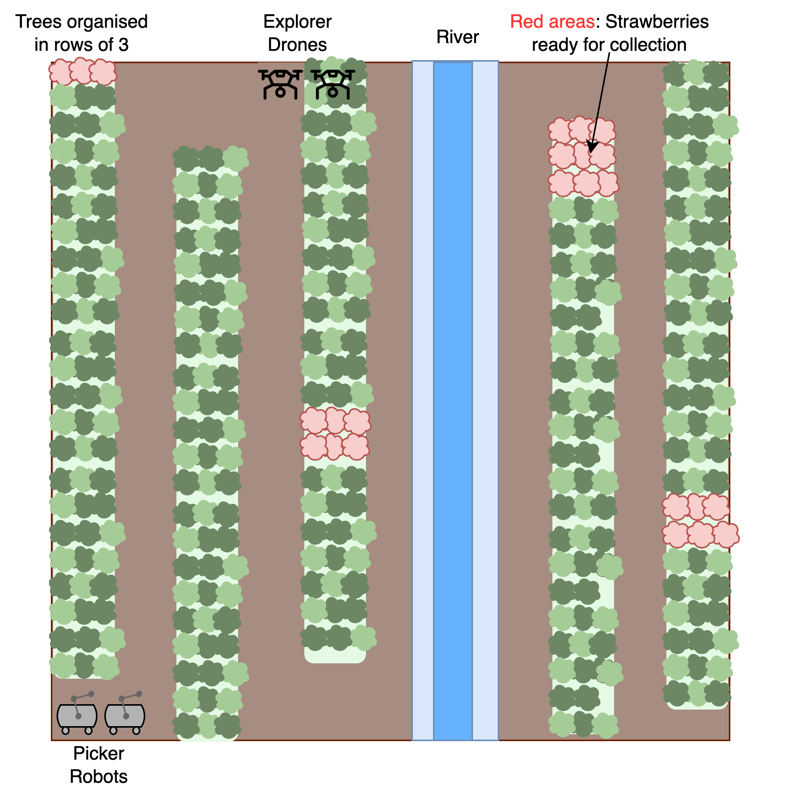

# Assessment Brief - PART 1 (Draft)

## Submission and feedback dates

This assignment includes 5 activities and there are two submission points defined. Only Submission Point 2 is compulsory, so you can decide to hand in all 5 activities in Submission Point 2. However, Submission Point 1 is intended to give you the opportunity to submit part of the work and receive feedback that you can use for the solution of the rest of activities.

As Submission Point 1 is optional, only the Submission Point 2 is eligible for 48-hour late submission window. If you submit activities 1 and 2 in Submission Point 1, then you are not allowed to re-submit these activities in the Submission Point 2. 

### Submission Point 1 (Optional)

| **Date Issued to Students**     	| **Submission Date** 	|
|---------------------------------	|---------------------	|
|  15/Oct/2024             	        | 12/Nov/2024        	|
| **Submission Channel**          	| **Submission Time** 	|
| Electronic via GitHub Classroom 	| 14:00             	|
| **Feedback and Marks By**  	|                     	|
| 26/Nov/2024 (TBC)                     	|                     	|

**N.B. all times are 24-hour clock, current local time (at time of submission) in the UK**

\hfill \newline

## Submission Details

| **Module Code**                  	| **Run**  	| **Module Title**                                	|
|----------------------------------	|----------	|-------------------------------------------------	|
| UFCXR-15-3                       	| 24SEP/1  	| Autonomous Agents and Multiagent Systems        	|
| **Module Leader**                	|          	| **Module Tutors**                               	|
| Marco Perez Hernandez (MPH)       |          	| MPH 	|

| **Assessment Type**               |   	      | **Weighting (% of the Module's assessment)**     	|
|----------------------------------	|----------	|-------------------------------------------------	|
| Individual Portfolio Assignment              |          	|  Whole assignment is 100% of the module marks. Activities 1 & 2 correspond to 30% of module marks.

### Submission Rules

This assessed work must be submitted by committing and pushing the solution to YOUR OWN INDIVIDUAL GITHUB REPOSITORY THAT IS CREATED ONCE YOU ACCEPT THE ASSIGNMENT. There will be one Github assignment for each submission point and NO OTHER GITHUB REPOSITORIES WILL BE ACCEPTED. Please follow these rules:

* Make sure your GitHub username is linked to your student username and ID.
* For each submission you will create a file named **`solution.md`** in the root of your repository with a brief description of the steps needed to run your solution. Likewise you should include links to the solution of each activity included in the submission. No word count limit here, but this is expected to be brief but enough to run your solution and appreciate the work you have completed.
* Python code should be organised within the `src` folder and should include a `requirements.txt` file indicating clearly the libraries used and the version. 
* For all programming activities, the code should be documented thoroughly. Implementation should be aligned to the design.
* Every file that you use in your solution should be copied in the repository. No links to partial solutions copied or uploaded to external repos or sites. 
* See Deliverables expected for each activity.

#### Use of Generative AI Tools

* You are allowed to use GenAI tools such as copilot, chatGPT and others if you want, although not necessary. Using these tools brings additional benefits but also risks, you MUST consider the following:
  
  * DO NOT feed these tools with any of the module materials (slides, assessments briefs,code provided, etc. ) Doing so constitutes a breach to copyright and you could be subject to UWE penalties.
  * Make a thoughtful use of these tools, it is not enough to copy and paste outputs of these tools in your solution. Just copying and pasting **will increase the risk of somebody else getting the same code or text you got. ANY CONTENTS OF YOUR SOLUTION THAT IS FOUND SIMILAR TO SOMEONE ELSE WILL TRIGGER THE ACADEMIC OFFENCE PROCEDURE WITH A LIKELY PENALTY**.
  * Any use of GenAI tools needs to be properly acknowledged in the `solution.md` file, you need to briefly indicate what tool(s) have you used and how.

## Module learning outcomes assessed:

1. Apply agent-based analysis and design skills and techniques, appropriate to solving complex AI problems.	
2. Identify situations where agent-based problem analysis, system design and programming paradigms are applicable and to create software that exploits them.	
3. Appraise the concepts of multi-agent systems including cooperation, competition, learning and develop multi agent systems to solve complex problems.

## Completing your assessment

### What am I required to do on this assessment?

In short, you need to develop a Multi-agent system using a simulation environment. You need to submit design diagrams, code and performance analysis. 

See **Assessment Specification** for more details.

### Where should I start?

Read carefully the specifications and identify key elements of the problem that should be considered in the solution. After that you can start outlining what are the elements to consider in your design and code. Use the code provided in the worksheets of the practical sessions as a reference point. There are some parts where you will need to revise the concepts covered during the lectures and see how you can apply those in your solution.

### What do I need to do to pass?

The minimum to pass is 40 marks. See the marking criteria at the end of this document. 

### How do I avoid an Assessment Offence on the module?

This is an individual assignment. Even though you can reuse part of the code and material provided in the practical sessions, this assignment requires you to create and entire new system and solve a new problem. Naturally your approach and specific solution should be different from your classmates. Although you can discuss and collaborate with others during the practical sessions. The best way to stay safe is not sharing any part of your solution with others, this way the solution that you submit will be unique.

## **Assignment Specification**

### **Robot-Assisted Farming**

In the last few years, robots have been used in agriculture. These are useful to improve efficiency in farming operations as robots can work tirelessly at different weather and terrain conditions. A recent example from [*A California Farm*](https://www-cbsnews-com.cdn.ampproject.org/c/s/www.cbsnews.com/amp/news/robots-pick-strawberries-california/) shows how picker robots are introduced to pick strawberries. While these robots have the ability to make some decisions a human operator is still required. 

For this coursework, assume the hardware for two types of next generation farming robots has been built with the following characteristics:

**Amphibious Picker Robots**

These are basic robots that are able to operate fully autonomously. These robots have an arm with ability to cut strawberries from trees as well as store and carry them. Once the robot's storage is full they need to return to the base. 
These robots are able to move in rough farm terrain and also across watery surfaces (e.g. rivers) without compromising the payload. However, the speed of these robots gets limited when these are moving through water. Moreover, these robots can not move through trees so need to use existing lanes. 

**Explorer Drones**

These are drones that are able to explore autonomously and send signals to other robots (e.g. to picker robots) about the location of the crops that need to be picked. These robots move in 6 directions: front, back, left, right, up and down. These drones fly over trees taking pictures of the crops, then computer vision algorithms are used to calculate the urgency for collection of the crops in a given area.

### Operation Modes

#### Basic Mode

* Exploring and movement around the farm according to each type of robot capabilities.
* Drones locate crops to be collected and wait for the picker robots, once they get there, the drones continue exploring.
* Amphibious picker robots move randomly to locate the crops to be collected, pick the crops until their storage is full, in that case they return to the base station to unload the crops collected and continue picking.
* Robots have a battery whose energy is consumed as time progresses.

#### Extended Operation

To be released.

### Environment

* The configuration of the environment, including the location of robots and all elements in the environment, can be random, in other words, robots are intended to work with any  configuration of the same group of elements.
* The number of robots of each type to be deployed for a particular mission can be pre-defined by operators. 

---

**ACTIVITIES 1 AND 2 ARE ELIGIBLE TO BE SUBMITTED IN SUBMISSION POINT 1**

Assume you have been hired to develop the software for the next-generation of these robots. You are asked to complete the following activities:

### Activity 1: Agent System Development - Release 1.0 (up to 20% assignment marks)

For this activity you will develop a multi-agent system that will operate in a simulated environment. In your system the robots work according to the [**basic mode**](#basic-mode) of operation. Your simulation environment should look as presented below. While the environment representation might not be exactly the same of the figure, your environment must include the elements present in this figure.  

As part of your development you need to identify the actions, states and transitions of the autonomous agents that will control the robots considering the available hardware features. Your design will define the way robots make decisions to trigger the required actions and then the implementation should follow this design. Testing should cover the unit tests of environment creation and key functions implemented for each agent.

#### Deliverables

1) [Design] Statechart diagrams of the autonomous agents that control the robots according to the *Basic Mode* of operation. 
2) [Implementation] Python code of the simulation according to the *Basic Mode* of operation. 
3) [Testing] Python code of the unit tests of the functions developed covering the *Basic Mode* of operation. 

### Activity 2: Robot Farming Games (up to 10% assignment marks)

You need to propose a game where 2 farming robots as the ones described in this specification are interacting and analyse their interactions using a reference game. Pick one of the common games studied in game theory (See list [here](https://en.wikipedia.org/wiki/List_of_games_in_game_theory) ) and use it as reference to define a situation where only **two** farming robots need to compete or cooperate. For example, a basic situation would be that the two robots are facing each other aiming to move in opposite directions, similar to the `game of chicken` discussed in the lectures. Your game should contain all the elements of a game as described in the course lectures. 

#### Deliverables

1) A set of max **FIVE** slides as follows:

* Slides 1-3: Game description and analysis including key elements identified in lectures.
* Slide 4: Brief reflection of how the proposed game could be useful in a practical farming scenario with clear justification, identifying elements of the game that fit well with the scenario and potential issues or weaknesses of the game for modelling the given scenario. 
* Slide 5: Any reference you might have used for your solution.
  
You can use figures, diagrams, tables and real world examples to strengthen your solution.

### Activities 3, 4 & 5

To be released.

**This assignment is subject to standard UWE's personal circumstances policies as found [*here*](https://www.uwe.ac.uk/study/academic-information/personal-circumstances/late-submission-window)**

## Marks and Feedback

Your assessment will be marked according to the marking criteria available [here](rubrics1.md)

