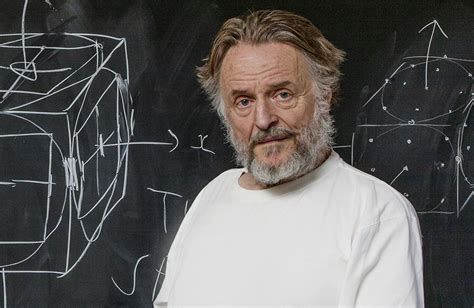

# Activity 1

We will use one of the earliest ABMs to explore MESA operation. The following implementation is slightly adapted from MESA examples.

In this activity you need to:

1. *Read* and *understand* the code snippets provided here
2. Once you understand them *copy* and *paste* them in the corresponding files in the `src` folder.
3. Then you can try to run your first ABM simulation. 
4. Analyse the different outputs of the model and the behaviour of the key methods e.g. step.
5. commit and push the resulting source code.

You will find some questions that will guide you and help you understand the code.

## Conway's Game of Life (GoL)

Invented by British mathematician *John Conway* (1937 - 2020). 




The game is defined as a **zero-player game**, meaning that is a game able to play itself as time passes, with no input from a (human) player. It is also regarded as a **cellular automaton**, consisting of a regular grid of cells, each in one of a finite number of states, such as on and off. Conway's GoL is usually regarded as one of the first agent-based models. 


See this [video](https://www.youtube.com/watch?v=CgOcEZinQ2I) for brief introduction.

The game takes place in a grid, where cells are the main characters, so: 

* Cells have a **state** which could be *ALIVE* or *DEAD*

* Cells **behave** following three main rules:
   
     1. If a cell is *ALIVE* and 2 or 3 of its *neighbour* are too, then the cell survives the next time step.
        
     2. If a cell is *DEAD*, but 3 of its *neighbour* are *ALIVE*, then the cell becomes *ALIVE* the next time step.
        
     3. All other *ALIVE* cells die and those already *DEAD*, remain *DEAD*.


### MESA Installation

 Simply install by using `pip`:

```python

     pip install mesa

```

If `pip` is not installed please check [here](https://pip.pypa.io/en/stable/installation/) for instructions of how to install it.


### Agent definition

We start defining our model from the bottom. The smallest entity that is capable of *autonomous behaviour*. In this case the **cell**.

```python

    class Cell(mesa.Agent):

    DEAD = 0
    ALIVE = 1

    def __init__(self, pos, model, init_state=DEAD):
        
        super().__init__(pos, model)
        self.x, self.y = pos
        self.state = init_state
        self._nextState = None

    @property
    def isAlive(self):
        return self.state == self.ALIVE

    @property
    def neighbors(self):
        return self.model.grid.iter_neighbors((self.x, self.y), True)

    def step(self):
        
        # Get the neighbors and apply the rules on whether to be alive or dead
        # at the next time step.
        live_neighbors = sum(neighbor.isAlive for neighbor in self.neighbors)

        # Assume nextState is unchanged, unless changed below.
        self._nextState = self.state

        if self.isAlive:
            if live_neighbors < 2 or live_neighbors > 3:
                self._nextState = self.DEAD
        else:
            if live_neighbors == 3:
                self._nextState = self.ALIVE

    def advance(self):
        self.state = self._nextState

```

### Questions (For you to think and discuss with classmates, no need to submit answers)

* Do you recall what a class is? and what does it mean that `(mesa.Agent)` in the class header? 
* How many methods does this class have? 
* What each method seems to be doing?
* Can you identify differences between agents and objects/classes as discussed in the lecture 1?
* There seems to be calls to MESA-specific methods. What do you think the `self.model.grid.iter_neighbors` method  call does? 
* In this code snippet, what other methods do you think are built-in provided by the MESA library? 

Now check what the MESA methods really as per the [MESA docs](https://mesa.readthedocs.io/en/latest/mesa.html).


### Key things to note:

* Note we are creating a *class* of agents, meaning we will be able to create multiple *instances* of this agent of type *cell*.

* This agent is inheriting from `mesa.Agent` which is the `mesa` class we should always use as base for defining new type of agents.

* This class implements the *constructor*   `def __init__...`, which simply defines the initial state of our agent e.g. position and whether it is *ALIVE* or *DEAD*

* The main function that defines the behaviour of the agent throughout the simulation is `def step(self)` . Here is where the main rules for agent behaviour are defined.


### Model Definition

Now that we have created the type of agents of our model, we need to create a model that will create agents of the type defined (`Cell`), place them in our 2D environment and enable us to run the model:

```python

class ConwaysGameOfLife(mesa.Model):

    def __init__(self, width=50, height=50):

        # Set up the grid and schedule.

        # Use SimultaneousActivation which simulates all the cells
        # computing their next state simultaneously.  This needs to
        # be done because each cell's next state depends on the current
        # state of all its neighbors -- before they've changed.
        self.schedule = mesa.time.SimultaneousActivation(self)

        # Use a simple grid, where edges wrap around.
        self.grid = mesa.space.SingleGrid(width, height, torus=True)

        # Place a cell at each location, with some initialized to
        # ALIVE and some to DEAD.
        for contents, (x, y) in self.grid.coord_iter():
            cell = Cell((x, y), self)
            if self.random.random() < 0.1:
                cell.state = cell.ALIVE
            self.grid.place_agent(cell, (x, y))
            self.schedule.add(cell)

        self.running = True

    def step(self):
        
        self.schedule.step()

```

### Questions (For you to think and discuss with classmates, no need to submit answers)

* Why the `step` method is here in the model (`ConwaysGameOfLife`) and also in the agent (`Cell`) class?
* What does the `.grid.place_agent` method does?
* What is the purpose of the `schedule` object?

### Key Things to note:

* We are using a scheduler called `SimultaneousActivation` from MESA, which activates all the agents of the model simultaneously.
* The `step` function in this case use the scheduler to move the model one step forward in time i.e. progress the simulation model.

### UI

MESA provides a built-in web interface that can be personalised and configured according to the needs of the model.

```python

def portrayCell(cell):
 
    if cell is None:
        raise AssertionError
    return {
        "Shape": "rect",
        "w": 1,
        "h": 1,
        "Filled": "true",
        "Layer": 0,
        "x": cell.x,
        "y": cell.y,
        "Color": "black" if cell.isAlive else "white",
    }

```

### Questions (For you to think and discuss with classmates, no need to submit answers)

* Do you know what shape could mean? 
* What other values the Shape property could have?

### Key things to note

* This customised function is defining how do we want our agents of type `Cell` to be resented. 


In the next code we instantiate the visualisation grid using the defined properties for the `Cell` agents. Finally we create a server with the model built.

```python

# Make a world that is 50x50, on a 250x250 display.
canvas_element = mesa.visualization.CanvasGrid(portrayCell, 50, 50, 250, 250)

server = mesa.visualization.ModularServer(
    ConwaysGameOfLife, [canvas_element], "Game of Life", {"height": 50, "width": 50}
)


```

Now our model is ready to run, just need to use the server instance created and call the `launch` method (this is done in `run.py` file). A browser window should be triggered with controls for you start, step or stop. 

```python

server.launch()

```
# Troubleshooting

* MESA carried out a substantial improve last year moving from version 1 to 2. If you experience issues check that you have the right version installed. Use the `requirements.txt` file located in the root to install via `pip` the needed dependencies.