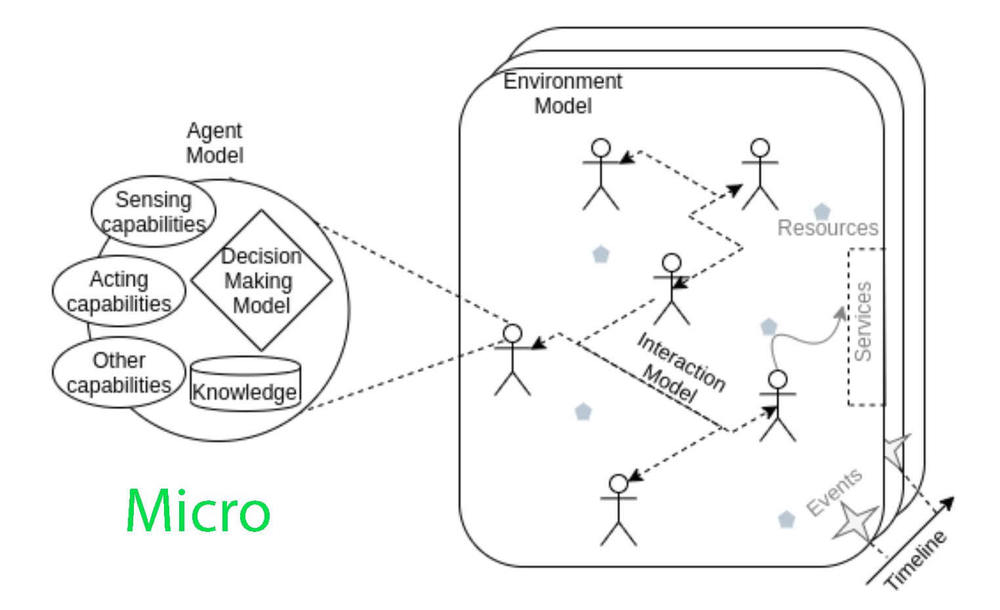
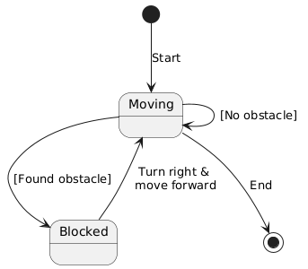

# AA-MAS - Worksheet 2-3 

COPYRIGHT &copy; 2024 University of the West of England. All rights reserved. Author: Marco Perez Hernandez.

**IMPORTANT** <u>This worksheet is meant to be completed within two weeks</u>.

**Date**: 10/Oct/23 - 17/Oct/23
 
**Topic**: Agent Architectures

**Objective**: Learn and practice the design and implementation of a basic agent architecture in the context of a warehouse application.

## Overview

We have seen that there are two perspectives for building agent-based systems, the micro and the macro perspective. During these sessions we will focus on building the micro architecture of the agent, particularly, we will focus on how the agent make decisions.

## Rule-based Architecture

This is a simple architecture that enables the agent to make decisions using a set of pre-defined rules. These rules follow the structure:

``Event => Condition ==> Action ``

The **Event** sets the start of the rule, this is normally something that happened in the environment where the agent is embedded, it could be the action triggered by one agent or just the product of the environment dynamics.
The **Condition** defines the criteria that the agent will consider to trigger different actions. 
The **Action**, It defines what the agent is going to execute if the condition is met. 

### **Example**

* *Event*: The robot under control *senses* an obstacle in front
* *Condition*: The robot under control is *one step away* of the obstacle
* *Action*: The robot under control *turns to the right* and then *move* forward

An alternative representation of this rule could be using *Statechart Diagrams* as follows:

In this diagram, we define two states, represented as squares: *Moving* and *Blocked*. The agent starts in *Moving* state and then it can transition to either *Moving* state or *Blocked* state. The transitions are represented by arrows between the squares and represent events (in brackets) or actions being triggered. In the diagram, the agent/robot will transition from *Moving* to *Blocked* if the condition *[Found obstacle]* is met. Likewise, it will transition from *Blocked* to *Moving* once the action *Turn right \& move forward* is triggered.

We are going to practice how to build a simple Robot agent using a rule-based architecture and reflect on how to implement alternative architectures. 

**Activities**

* [Activity 1](aamas-w2-t1.md)
* [Activity 2](aamas-w2-t2.md) 
* [Activity 3](aamas-w2-t3.md) [OPTIONAL]