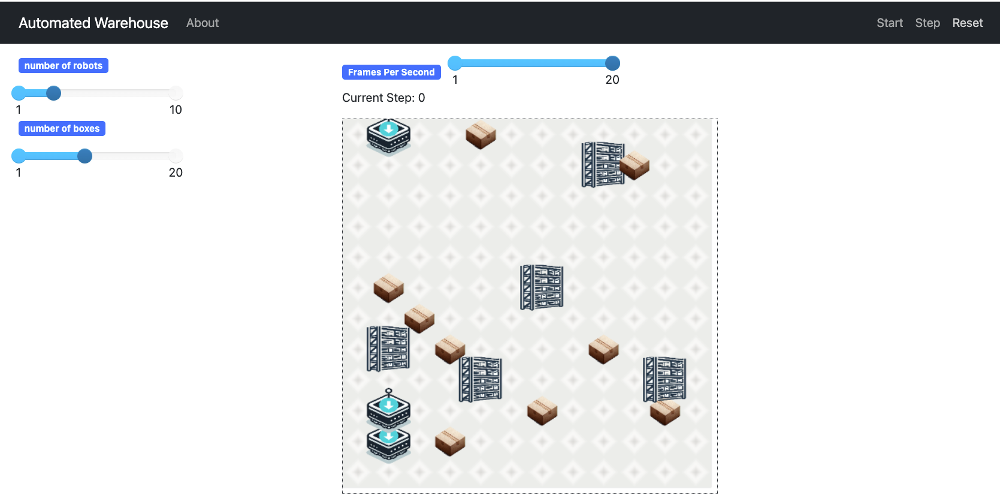

# Activity 3 [OPTIONAL]

In this activity you should enhance the model built in the first activity by incorporating, features, actions and rules for the scenario presented in the following figure:

In this scenario:

* Boxes appear at different locations (x,y) of the environment, not always in the same lane of the robots.
* The robots pick boxes by moving vertically and horizontally in the 2D space.
* Robots are able to avoid obstacles including other robots, a simple collision avoidance is enough.
* Boxes are collected and dropped in the cell at the top left edge of the grid environment.

[back](README.md)