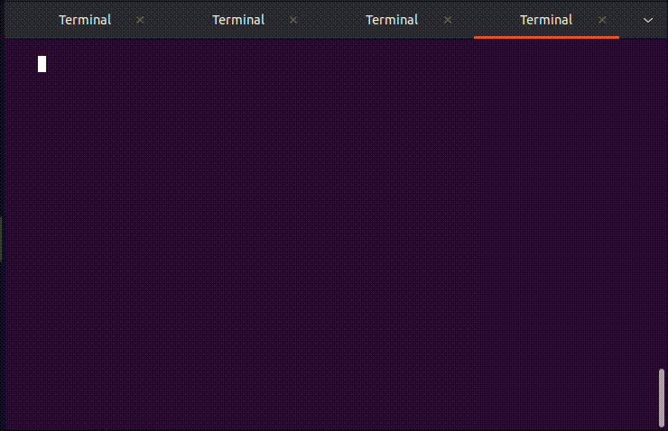
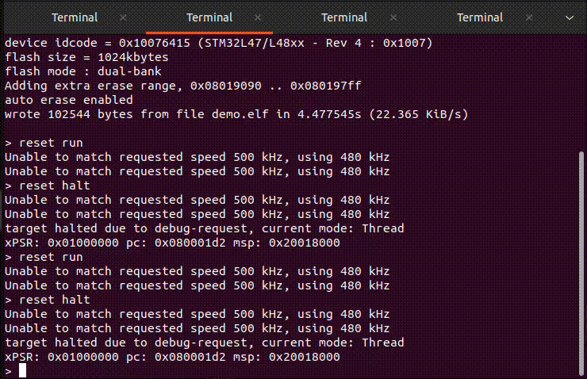
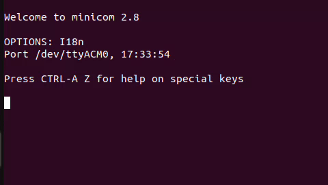
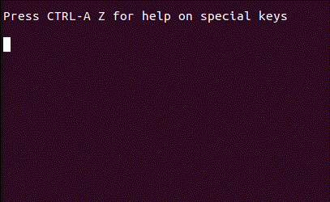

# Ilyas-esp

you can't check yourself if the code actually works, as it needs makefiles and a ton of other files and takes too much space, so you will have to trust me

## WorkSheet3 GPIO ports and pins

#### Pass exercise 1

#### Pass exercise 2

#### Credit exercise

## WorkSheet4 get/putchar routines and newlib/printf/scanf

#### 4.1

#### 4.2

## WorkSheet5 Interrupts

#### 5.1

#### 5.2 UART

#### 5.2 PCR

